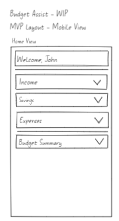
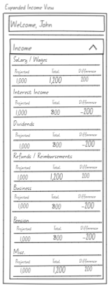
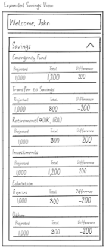
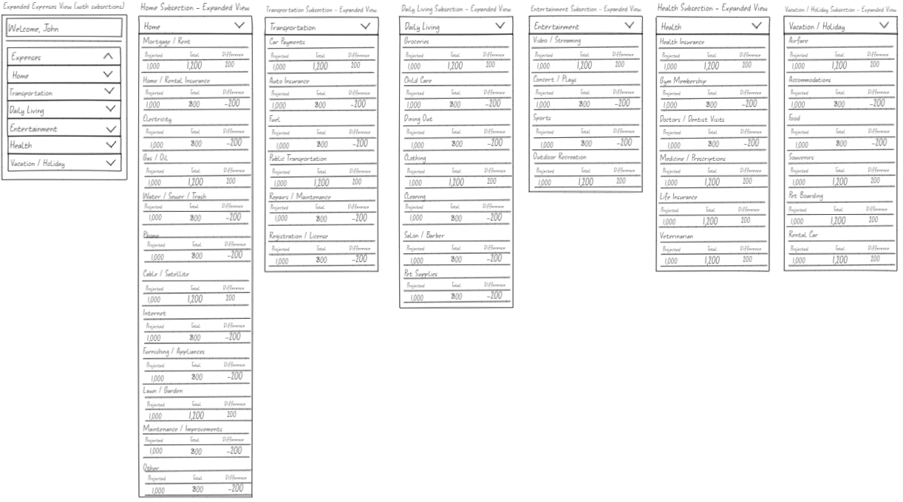
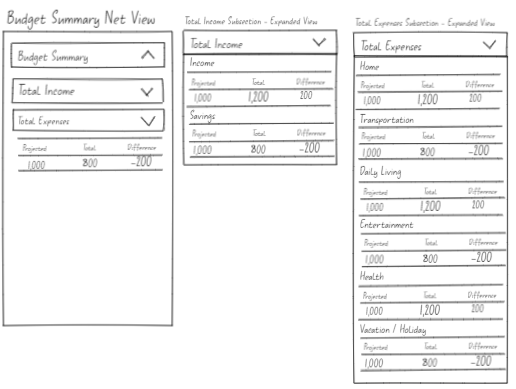

# Budget Assist (Placeholder Name) - WIP

## Overview

Budget Assist is a financial management application designed to empower users to effectively manage their finances by tracking their income, savings, and expenses. This intuitive tool allows users to input their financial data, which is then processed to provide a comprehensive budget summary. The summary offers insights into the users' financial health, highlighting areas of strength and identifying potential improvements. By leveraging Budget Assist, users can make informed decisions to achieve their financial goals, ensuring a balanced budget and encouraging financial stability. The application’s user-friendly interface and robust data analysis capabilities make it an essential tool for anyone looking to take control of their financial future.

## Project Mockup

Budget Assist is organized into four main sections, each designed to capture and analyze different aspects of a user's financial profile:

Click to view Budget Assist Home View

### Income
- Salary/Wages: Users can enter earnings from employment.
- Interest Income: Income from interest on savings or other investments.
- Dividends: Income derived from shares of stock.
- Refunds/Reimbursements: Any money returned or reimbursed, which may include tax refunds.
- Business: Earnings from self-employed or business activities.
- Pension: Retirement income from pension funds.
- Miscellaneous: Any other forms of income not categorized elsewhere.

Click to view Income Section

### Savings
- Emergency Fund: Contributions to funds reserved for unplanned expenses.
- Transfer to Savings: Regular allocations to savings accounts.
- Retirement (401K, IRA): Contributions to retirement accounts.
- Investments: Money put into stocks, bonds, or other investment vehicles.
- Education: Savings for educational purposes.
- Other: Any other forms of savings.

Click to view Savings Section

### Expenses

- Home: Includes mortgage or rent, utilities, and other household expenses.
- Transportation: Expenses related to personal or public transportation.
- Daily Living: Costs of groceries, clothing, and other day-to-day expenses.
- Entertainment: Spending on leisure activities.
- Health: Medical expenses, gym memberships and health insurance.
- Vacation/Holiday: Costs associated with travel and holidays.

Click to view Expenses Section

### Budget Summary

- Total Income: Sum of income and savings entries.
- Total Expenses: Aggregated expenses from all subsections.

Click to view Budget Summary Section

## Roadmap

The development of Budget Assist is ongoing, and several exciting features are planned for future releases to enhance user experience and functionality. Here’s what’s on the horizon:

- **Drag-and-Drop Functionality:** We are planning to introduce a user-friendly drag-and-drop interface that will allow users to easily rearrange the order of income, savings, and expense items. This feature will make budget management more intuitive and flexible.

- **User Authentication:** To ensure that users can securely access their data, we will implement user authentication features. This will include secure login processes, password protection, and the ability to handle multiple user profiles within a single application.

- **Customization Options:** Users will soon be able to fully customize their financial tracking by adding, removing, or editing income, savings, and expense items. This enhancement will provide greater control over budget categories and enable a more personalized budgeting experience.

These features are designed to make Budget Assist not only more interactive but also more secure and tailored to individual user needs. We are committed to continuous improvement and are excited to bring these enhancements to our users.

## Feedback and Suggestions

We value the input of our users and believe that the best way to improve Budget Assist is through community feedback. If you have suggestions on how to make Budget Assist better or if you have identified issues that need attention, please feel free to share your thoughts with us. Your feedback is crucial in shaping the future of Budget Assist and ensuring that it meets the needs of its users.

## Tech Stack

Budget Assist is built using a modern technology stack that ensures a responsive, efficient, and scalable application. Here’s a breakdown of the technologies employed:

- **Front-end:** The user interface of Budget Assist is developed using React, a powerful JavaScript library for building dynamic and interactive user interfaces. React's component-based architecture facilitates efficient development and offers robust features that enhance user experience.
    - React

- **Back-end:** For back-end operations, Budget Assist utilizes Mongoose along with MongoDB. Mongoose serves as an elegant MongoDB object modeling tool designed to work in an asynchronous environment, providing a straightforward schema-based solution to model application data. MongoDB, a NoSQL database, is used for storing data in a flexible, JSON-like format, ensuring quick access and ease of management.
    - Mongoose
    - MongoDB

## Contribution

Budget Assist is an open-source project, and contributions are warmly welcomed. If you're interested in helping improve Budget Assist, please feel free to make pull requests. Whether it's fixing bugs, adding new features, or improving documentation, your help is greatly appreciated. To contribute:

1. Fork the repository on GitHub.
2. Clone your forked repository to your local machine.
3. Create a new branch for your modifications (`git checkout -b feature-branch`).
4. Make your changes and commit them (`git commit -am 'Add some feature'`).
5. Push to the branch (`git push origin feature-branch`).
6. Create a new Pull Request.

Please ensure your contributions adhere to the project coding standards and guidelines, which can be found in the repository's CONTRIBUTING.md file. We look forward to your pull requests and are excited to see how you can help improve Budget Assist!
